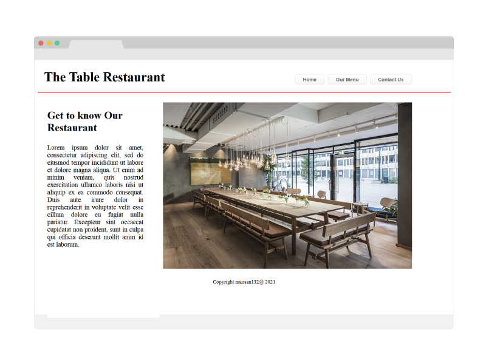

# Project Name

> This project is about Javascript ES6 modules and Webpack. I make a website for a fictitious restaurant with 3 sub pages,
and all the logic and presentation will be supported by and inside js modules. Every page loads without any http request.

## Built With

- HTML5
- CSS3 with Cssgrid and Flexbox
- Javascript
- ES6 modules
- Webpack

## Live Demo

[Live Demo Link](http://mauriciosantos.paternit.com/io/restaurant/)

## Getting Started

To preview the site:

- Go to live demo Uri
- Use navigation on to to browse the site

To get a local copy up and running follow these simple example steps.

- Clone the repository
- Install node on your computer and ensure that you have node modules
- Install webpack and set it up using this [guide](https://webpack.js.org/guides/asset-management/#setup)
- Test whether it is running well

## Author

👤 **Mauricio Santos**

- Github: [@maosan132](https://github.com/maosan132)
- Twitter: [@maosan132](https://twitter.com/maosan132)
- Linkedin: [maurisantos](https://www.linkedin.com/in/mauricsantos)

## 🤝 Contributing

Contributions, issues, and feature requests are welcome!

Feel free to check the [issues page](issues/).

## Show your support

Give a ⭐️ if you like this project!

## Acknowledgments

- Hat tip to anyone whose code was used
- Inspiration
- etc

## 📝 License

This project is [MIT](lic.url) licensed.
